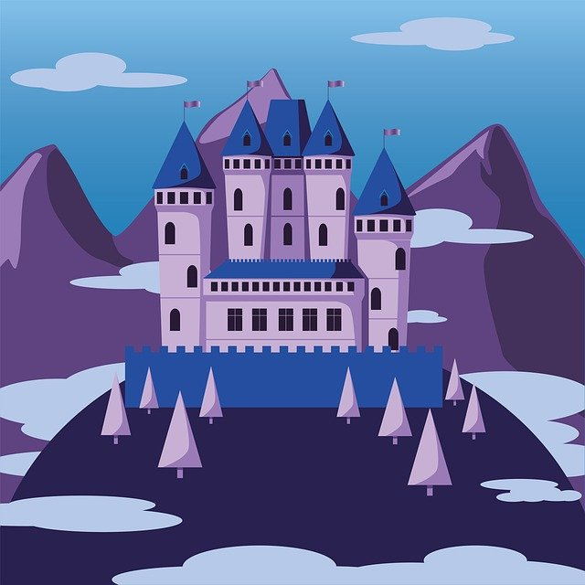

# eucyon-tribes

This is our Tribes project :)
More information will be added soon :)

## Buildings production:

- TownHall: 2 People 
- Farm: 5 Food 
- Mine: 7 Gold 
- Sawmill: 15 Wood 
- Barracks: 1 soldier

## Buildings creation and updating costs:

### Creation costs: 

- Farm: 35 Wood, 15 Gold 
- Mine: 35 Wood, 10 Food
- Sawmill: 15 Gold, 10 Food
- Barracks: 50 Gold, 40 Food, 100 Wood

### Upgrading costs:

Cost of upgrade is calculated as creation cost * desired level.

- Townhall: (100 * level) Gold, (85 * level) Food, (200 * level) Wood / At least (25 * level) soldiers are needed in the kingdom for the Townhall to upgrade. 

## Soldier creation and updating costs:

### Creation cost:

- Soldier: 10 Gold, 5 Food, 1 People

### Upgrading costs:

- Soldier: (10 * level) Gold, (5 * level) Food

### Battle rules:

[Battle rules PDF](./BattleRules.pdf)
